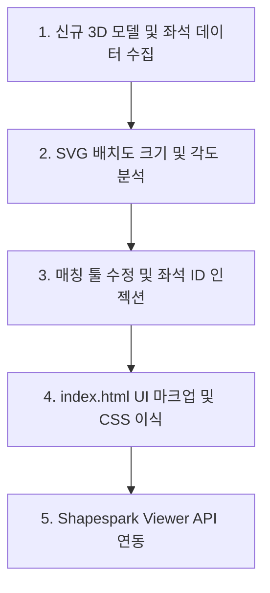

# 🚀 Shapespark 3D 좌석 시야 연동 서비스 이식 가이드 (Porting Guide)

이 문서는 다른 3D 모델(Shapespark 소스)과 신규 좌석배치도(SVG)를 활용하여 본 프로젝트와 동일한 **"3D 가상 시야 + 2D 좌석배치도 연동 아키텍처"**를 가장 빠르고 정확하게 복제 및 구축하기 위한 보조 설명 파일입니다.

---

## 📋 전체 구축 프로세스 요약



---

## 🛠️ 1단계: 신규 소스 및 데이터 준비 (Prerequisites)

새로운 프로젝트를 구성하기 위해 아래 3가지 파일이 필요합니다.

1.  **Shapespark 3D 데이터 폴더:** Shapespark 웹 에디터에서 빌드(Bundle)한 결과물 디렉터리 (예: `2026-05-22-19-41-08/`).
2.  **신규 좌석배치도 파일:** ID가 부여되지 않은 순수 디자인 상태의 SVG 포맷 좌석배치도 (예: `seatmap_kor.svg`).
3.  **JS 좌석 맵 메타데이터:** 각 좌석의 식별자(View_ID), 층(Floor), 구역(Zone), 행(Row), 열(Seat) 및 해당 위치의 3D 카메라 View 이름이 매핑된 JS 파일 (예: `gs_arts_center_seatmap.js`).

---

## 📐 2단계: 신규 SVG 데이터 분석 및 패턴 분류

새로운 SVG 파일에서 좌석을 구성하는 사각형(`<rect>`) 요소들의 기하학적 특성을 먼저 파악해야 합니다.

1.  **좌석 크기(크기 사양) 확인:**
    *   SVG 텍스트 파일을 열고 좌석 사각형의 `width`와 `height` 값을 파악합니다. (예: 가로 13px, 세로 15px)
2.  **`analyze_svg_zones.py` 파일의 타겟 설정 수정:**
    ```python
    # analyze_svg_zones.py 내 경로 및 크기 설정 수정
    JS_PATH   = r"c:\WORK\[새_프로젝트_폴더]\[새_좌석맵].js"
    SVG_PATH  = r"c:\WORK\[새_프로젝트_폴더]\[새_좌석배치도].svg"
    
    # rects.append 조건 부분에서 새로 파악한 w, h 범위 설정
    if 5 <= w <= 50 and 5 <= h <= 50:
        rects.append((x, y))
    ```
3.  **스크립트 실행 및 결과 해석:**
    *   터미널에서 이 분석 스크립트를 실행하여 좌석의 회전(Rotation) 각도 그룹과 X, Y 좌표 범위를 출력합니다.
    *   예: 좌측 구역은 `rotate(7)`, 중앙은 `rotate(0)`, 우측은 `rotate(-7)` 등 특수한 회전 값을 식별해 둡니다.

---

## ⚡ 3단계: 자동 매핑 실행 및 좌석 ID 인젝션

분석이 끝나면 `fill_svg_ids.py` 또는 `fill_svg_ids.html`을 수정해 새 SVG 파일에 좌석 ID를 일괄 주입합니다.

1.  **매칭 도구 파일 수정 (`fill_svg_ids.py` 또는 `.html` 내 정규식):**
    *   새로 파악한 `<rect>`의 고유 정규식 패턴을 대입합니다.
    ```javascript
    // fill_svg_ids.html 33번 라인 부근의 정규식을 새 SVG 규격에 맞춥니다.
    // (예: width="13" height="15" 대신 새 가로/세로 값 입력)
    const rectRegex = /<rect\s+(id="([^"]*?)"\s+)?x="([^"]*?)"\s+y="([^"]*?)"\s+width="[새가로]"\s+height="[새세로]".../g;
    ```
2.  **구역 정렬 매핑 규칙 수정:**
    *   회전 각도에 매핑되는 실제 구역 알파벳(또는 이름)을 정해 줍니다.
    ```javascript
    // 구역 회전에 따라 JS 데이터 상의 구역 코드 매핑 (A구역, B구역 등)
    // rotation 7 -> A, rotation 0 -> B, rotation -7 -> C 등
    ```
3.  **인젝터 도구 실행:**
    *   **GUI 방식:** `fill_svg_ids.html`을 브라우저에 띄우고 **[Run Processing]** 버튼을 누르면 누락된 좌석 ID가 순차 주입된 새로운 SVG 파일 다운로드 링크가 나타납니다.
    *   **CLI 방식:** `python fill_svg_ids.py`를 실행하여 직접 파일을 덮어씁니다.

---

## 🎨 4단계: UI 구성 및 CSS 이식 (`index.html` 세팅)

신규 템플릿 프로젝트의 `index.html`에 아래의 핵심 구조와 CSS 테마를 이식합니다.

### ① 반투명 50% 글래스모피즘(Glassmorphism) 스타일 CSS 적용
```css
/* 메인 화면 하단 및 좌측 반투명 버튼 테마 */
.glass-button {
    background: rgba(255, 255, 255, 0.5); /* 50% 반투명 */
    backdrop-filter: blur(5px);
    border: 1px solid rgba(255, 255, 255, 0.3);
    border-radius: 8px;
    padding: 10px 20px;
    font-weight: bold;
    cursor: pointer;
    transition: background 0.3s ease;
}
.glass-button:hover {
    background: rgba(255, 255, 255, 0.8);
}
```

### ② 인라인 SVG 삽입 구조 (Inline SVG)
좌석의 클릭 이벤트를 DOM으로 부드럽게 제어하기 위해서는 `` 대신, HTML 코드 내부에 직접 `<svg>` 내용을 삽입(Inline SVG)하거나 JavaScript를 이용해 동적으로 HTML 내부 Container로 로드해야 합니다.
```html
<div id="seatmap-container" style="width: 100%; overflow: auto;">
    <!-- 이 container 내부에 ID가 주입된 SVG 데이터를 fetch하여 삽입합니다. -->
</div>
```

---

## 🔗 5단계: Shapespark Viewer API 연동

최종적으로 좌석 클릭 시 3D 카메라 뷰를 작동시키는 코드를 완성합니다.

### ① Shapespark Viewer API 스크립트 로드
```html
<!-- index.html 내 Shapespark API 로드 -->
<script src="[Shapespark_폴더]/bundle.js"></script>
```

### ② 뷰어 초기화 및 카메라 연동 자바스크립트 구현
```javascript
let viewer = null;

// Shapespark 뷰어 초기화
function initViewer() {
    const iframe = document.getElementById('shapespark-iframe');
    // viewer 객체 획득 (Shapespark API 문서 기반)
    viewer = new WALK.Viewer(iframe);
}

// 특정 좌석 클릭 시 호출될 카메라 전환 함수
function zoomToSeat(viewId) {
    if (!viewer) return;
    
    // JS 메타데이터에서 viewId에 해당하는 Shapespark Camera View 이름을 찾습니다.
    const seatInfo = GS_ARTS_CENTER_SEAT_MAP_DATA.find(s => s.View_ID === viewId);
    
    if (seatInfo && seatInfo.View_Name) {
        // Shapespark API를 사용하여 지정된 뷰로 부드럽게 카메라 이동
        viewer.switchToView(seatInfo.View_Name, 1.5); // 1.5초 동안 이동
    } else {
        console.warn(`이동할 3D 카메라 뷰를 찾을 수 없습니다: ${viewId}`);
    }
}

// SVG 좌석 클릭 이벤트 리스너 바인딩
document.getElementById('seatmap-container').addEventListener('click', function(e) {
    const seatRect = e.target.closest('rect');
    if (seatRect && seatRect.id) {
        const seatId = seatRect.id; // 예: "View_1F_A_1"
        console.log(`좌석 클릭됨: ${seatId}`);
        zoomToSeat(seatId);
    }
});
```

---

## 🌐 6단계: 다국어(영어) 대응 확장법

1.  **페이지 복제:** 국문 파일인 `index.html`과 `seatmap_kor.svg` 파일 작업이 완성되면, 이를 그대로 복제하여 `index_eng.html` 및 `seatmap_eng.svg`를 생성합니다.
2.  **영문 번역 치환:** `index_eng.html` 내의 텍스트 콘텐츠(조작 안내, 메뉴 이름)를 영어로 변경하고, 이미지 소스 및 연결 SVG 경로를 `seatmap_eng.svg`로 치환합니다.
3.  **언어 전환 버튼 구현:**
    ```html
    <!-- index.html -->
    <a href="index_eng.html" class="lang-switch">ENG</a>
    
    <!-- index_eng.html -->
    <a href="index.html" class="lang-switch">KOR</a>
    ```

---

이 가이드를 활용하면 다음 프로젝트에서도 동일한 기능을 단 하루 만에 안정적으로 완성도 높은 상태로 배포할 수 있습니다!
